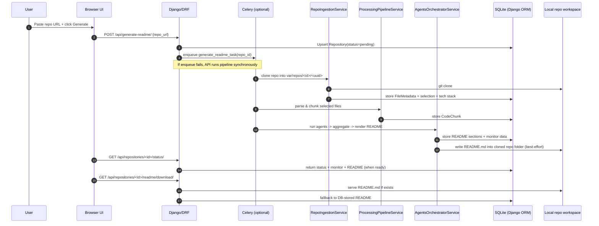

# README Generator (GitHub Repo → Best README)

Generate a clean, well-structured `README.md` for any public GitHub repository by pasting its URL.  
This project clones the repo, filters & selects relevant files, builds code “chunks”, then uses an LLM-powered agents pipeline to produce a polished README you can preview and download.

---

## Table of Contents

- [Features](#features)
- [How it works](#how-it-works)
- [Architecture](#architecture)
  - [High-level architecture diagram](#high-level-architecture-diagram)
  - [README generation flow](#readme-generation-flow)
- [API](#api)
- [Getting started (Local)](#getting-started-local)
  - [Prerequisites](#prerequisites)
  - [Setup](#setup)
  - [Run](#run)
  - [Optional: run with Redis + Celery worker](#optional-run-with-redis--celery-worker)
- [Project structure](#project-structure)
- [Configuration](#configuration)
- [Troubleshooting](#troubleshooting)
- [Future improvements](#future-improvements)
- [License](#license)

---

## Features

- **Web UI**: Paste a GitHub repo URL, generate, preview, and download `README.md`.
- **REST API**: Endpoints to start generation, poll status, and download the final README.
- **Repo ingestion**:
  - Clones repositories to a local workspace (`var/repos/...`)
  - Filters out binaries / large files / excluded directories
  - Stores file metadata in the database
  - Detects tech stack + selects the most relevant files for analysis
- **Code processing**:
  - Creates “chunks” per file + class + function (Python AST parsing, JS/TS regex parsing)
  - Stores chunks for the agents layer to reason over
- **Agents layer**:
  - Multiple specialized agents generate components like title, description, API endpoints, folder structure, installation, future improvements, TOC
  - Aggregates components and renders the final README markdown
- **Async-ready**:
  - Works **synchronously** out of the box (in-memory Celery broker runs tasks eagerly)
  - Can run **asynchronously** with Redis + a Celery worker by setting env vars
- **Monitoring & observability**:
  - Persists a `ReadmeGenerationMonitor` record with status, timing, token/cost summaries, and agent logs
  - View monitors in Django admin

---

## How it works

At a high level:

1. You submit a GitHub repo URL from the UI (or API).
2. The backend creates (or reuses) a `Repository` record.
3. A background job is queued via Celery (or runs synchronously if Celery isn’t available).
4. The pipeline:
   - **Clones** the repository
   - **Filters & stores metadata** for relevant files
   - **Detects tech stack** and **selects** the most meaningful files
   - **Parses & chunks** the selected files
   - Runs an **agents orchestrator** to generate README components
   - **Renders and stores** the final `README.md` and enables download

---

## Architecture

### High-level architecture diagram

```mermaid
flowchart LR
  U[User] -->|Repo URL| UI[Web UI<br/>(Django template + Tailwind)]
  UI -->|POST| API1[DRF API<br/>/api/generate-readme/]
  API1 -->|enqueue| C[Celery Task<br/>generate_readme_task]

  C --> ING[Ingestion<br/>clone + filter + metadata]
  ING --> PROC[Processing<br/>parse + chunk]
  PROC --> AG[Agents Orchestrator<br/>LLM calls]
  AG --> DB[(SQLite DB<br/>Repository/Files/Chunks/Monitor)]
  AG --> FS[(Cloned repo dir<br/>writes README.md)]

  UI -->|poll| API2[DRF API<br/>/api/repositories/:id/status/]
  API2 --> DB
  UI -->|download| API3[DRF API<br/>/api/repositories/:id/readme/download/]
  API3 --> FS
  API3 --> DB
```

### README generation flow



---

## API

Base URL: `http://localhost:8000`

| Endpoint | Method | What it does |
|---|---:|---|
| `/` | GET | Web UI (paste repo URL, preview, download) |
| `/api/generate-readme/` | POST | Starts generation for a repository URL |
| `/api/repositories/<uuid>/status/` | GET | Poll status + monitor + README sections (if ready) |
| `/api/repositories/<uuid>/readme/download/` | GET | Downloads `README.md` (from repo folder if present, else DB) |
| `/admin/` | GET | Django Admin (includes monitoring model) |

### Example request

```bash
curl -X POST "http://localhost:8000/api/generate-readme/" ^
  -H "Content-Type: application/json" ^
  -d "{\"repo_url\":\"https://github.com/pallets/flask\"}"
```

Then poll:

```bash
curl "http://localhost:8000/api/repositories/<repository_id>/status/"
```

---

## Getting started (Local)

### Prerequisites

- **Python**: recommended **3.9+**
- **Git**: required for cloning repositories
- (Optional) **Redis**: if you want async jobs with a Celery worker

### Setup

1. **Create and activate a virtual environment**

```bash
python -m venv .venv
```

**Windows (PowerShell):**

```bash
.venv\Scripts\Activate.ps1
```

2. **Install dependencies**

```bash
pip install -r requirements.txt
```

3. **Configure environment variables**

Copy the example env file and set your OpenAI key:

```bash
copy .env_example .env
```

Set at minimum:

- `OPENAI_API_KEY`: your OpenAI API key
- `OPENAI_MODEL`: default is `gpt-4o-mini`

4. **Run migrations**

```bash
python manage.py migrate
```

### Run

Start the Django server:

```bash
python manage.py runserver
```

Open:

- UI: `http://localhost:8000/`
- Admin: `http://localhost:8000/admin/`

### Optional: run with Redis + Celery worker

By default, this project uses an **in-memory** Celery broker and runs tasks **eagerly** (synchronously).  
If you want true background processing:

1. Start Redis (example, Docker):

```bash
docker run --rm -p 6379:6379 redis
```

2. Set env vars in `.env`:

```env
CELERY_BROKER_URL=redis://localhost:6379/0
CELERY_RESULT_BACKEND=redis://localhost:6379/0
```

3. Run a Celery worker (PowerShell):

```bash
celery -A core worker -l info
```

---

## Project structure

```text
.
├─ core/
│  ├─ backend/                          # Main app: ingestion, processing, agents, API, UI template
│  │  ├─ agents/                        # LLM agents + orchestrator + renderer
│  │  ├─ templates/core_backend/        # Web UI template (Tailwind CDN)
│  │  ├─ api_views.py                   # DRF endpoints (generate/poll/download)
│  │  ├─ ingestion_services.py          # Clone repo + filter + metadata + selection
│  │  ├─ processing_services.py         # Parse files + chunking into CodeChunk
│  │  ├─ readme_services.py             # Compose README (agents layer + legacy fallback)
│  │  ├─ tasks.py                       # Celery task entrypoint
│  │  ├─ models.py                      # Repository/FileMetadata/CodeChunk/Monitor schema
│  │  └─ ...                            # Utilities: tree rendering, stack detection, selection, monitoring
│  ├─ settings.py                       # Django config + OpenAI + Celery defaults
│  ├─ urls.py                           # Routes UI + API
│  └─ celery.py                         # Celery app config
├─ var/
│  └─ repos/                            # Default clone workspace (created at runtime)
├─ manage.py
├─ requirements.txt
├─ db.sqlite3                           # Local dev DB (SQLite)
└─ .env_example
```

---

## Configuration

Environment variables (see `.env_example`):

- **`OPENAI_API_KEY`**: required for README generation.
- **`OPENAI_MODEL`**: model name (default: `gpt-4o-mini`).
- **`README_TREE_LARGE_FILE_BYTES`**: omit subtrees that contain large files when rendering folder trees (default: \(512 \times 1024\)).
- **`CELERY_BROKER_URL`** / **`CELERY_RESULT_BACKEND`**:
  - Default: in-memory (`memory://` + `cache+memory://`) → tasks run eagerly (no worker required)
  - Set to Redis for real async execution

---

## Troubleshooting

- **`Unsupported repo URL`**: Use `https://...` or `git@...` style URLs.
- **Generation runs “synchronously”**:
  - This is expected with the default in-memory broker.
  - Configure Redis + start a Celery worker for true async jobs.
- **Download returns an empty file**:
  - The download endpoint will serve from the cloned repo folder if a `README.md` exists there; otherwise it falls back to the database copy.
  - If generation failed, check `/api/repositories/<id>/status/` for `last_error`.
- **Admin login**:
  - Create a superuser:

```bash
python manage.py createsuperuser
```

---

## Future improvements

- **Better repository support**:
  - Private repos via GitHub tokens
  - Branch selection + subdirectory mode (monorepos)
- **Smarter file selection**:
  - Language-aware heuristics per tech stack
  - Configurable include/exclude patterns from UI
- **Richer README output**:
  - Badges, screenshots, changelog section
  - Auto-detected commands (test/build/lint) from repo configs
  - Dependency graph & module diagrams
- **Performance & scalability**:
  - Streaming progress updates (SSE/WebSockets)
  - Caching + deduplication for repeated URLs
  - Parallel chunking and agent execution
- **Quality & safety**:
  - Stronger prompt hardening to avoid hallucinated setup steps
  - Token/cost budgets per job + configurable limits
  - More unit/integration tests + CI pipeline